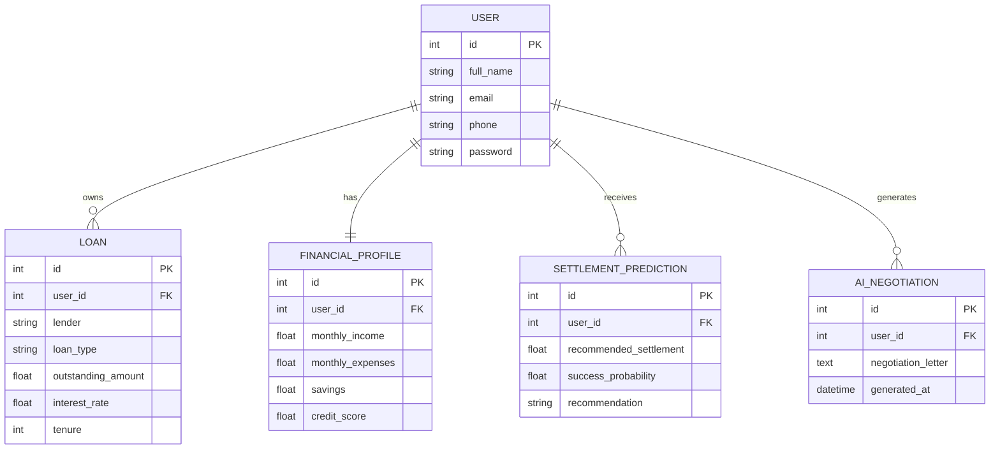

# 💰 AI-Powered Debt Relief & Financial Recovery Platform

> An intelligent AI-driven web application that helps users analyze their financial condition, predict debt settlement strategies, and generate personalized negotiation letters using Generative AI.

---
## 🗄️ Entity Relationship (ER) Diagram


## 📌 Project Overview

Managing debt can be stressful and time-consuming. This platform simplifies the debt recovery process by leveraging Artificial Intelligence to analyze financial information and recommend the best debt settlement options.

The application enables users to securely manage loan information, evaluate financial health, receive AI-powered settlement recommendations, and automatically generate professional negotiation letters.

---

## ✨ Key Features

- 👤 User Registration & Secure Login
- 💳 Loan Management System
- 📊 Financial Profile Analysis
- 🤖 AI-Based Debt Settlement Prediction
- 📝 AI Negotiation Letter Generation
- 📈 Financial Dashboard
- 🔒 Password Encryption & Authentication
- 💾 SQLite Database Integration
- ⚡ FastAPI REST APIs
- 🎨 Responsive React Frontend

---

## 🛠️ Technology Stack

### Frontend
- React.js
- Vite
- HTML5
- CSS3
- JavaScript

### Backend
- FastAPI
- Python
- SQLAlchemy
- SQLite
- Passlib
- Pydantic

### Artificial Intelligence
- Google Gemini API

---

## 📂 Project Structure

```
AI_DEBT_RELIEF
│
├── Source_Code
│   ├── backend
│   └── frontend
│
├── 1. Brainstorming & Ideation
├── 2. Requirement Analysis
├── 3. Project Design Phase
├── 4. Project Development Phase
├── 5. Project Planning Phase
├── 6. Project Testing
├── 7. Project Documentation
├── 8. Project Demonstration
│
├── Assets
└── README.md
```

---

## 🚀 Installation

### Clone Repository

```bash
git clone <repository-link>
cd AI_DEBT_RELIEF
```

### Backend

```bash
cd Source_Code/backend

python -m venv venv

venv\Scripts\activate

pip install -r requirements.txt

uvicorn app.main:app --reload
```

---

### Frontend

```bash
cd Source_Code/frontend

npm install

npm run dev
```

---

## 🔑 Environment Variables

Create a `.env` file inside the backend folder.

```
GEMINI_API_KEY=YOUR_API_KEY
SECRET_KEY=YOUR_SECRET_KEY
```

---

## 📸 Application Modules

- User Authentication
- Loan Management
- Financial Profile
- Debt Settlement Prediction
- AI Negotiation Letter Generator
- REST API Services
- Database Management

---

## 🎯 Future Enhancements

- Cloud Deployment
- Multi-user Support
- Email Notifications
- Credit Score Analysis
- EMI Calculator
- Mobile Application
- Banking API Integration
- Advanced Financial Analytics

---

## 📊 Project Status

✅ Completed Successfully

---

## 👨‍💻 Developed By

**Jathin Maddineni**

B.Tech – Artificial Intelligence & Machine Learning

SRM University AP

---

## 🙏 Acknowledgement

This project was developed as part of the **SmartBridge Internship Program** to demonstrate the practical implementation of Artificial Intelligence, Full Stack Development, and REST API integration for solving real-world financial problems.

---

### ⭐ If you found this project useful, don't forget to Star the repository!
